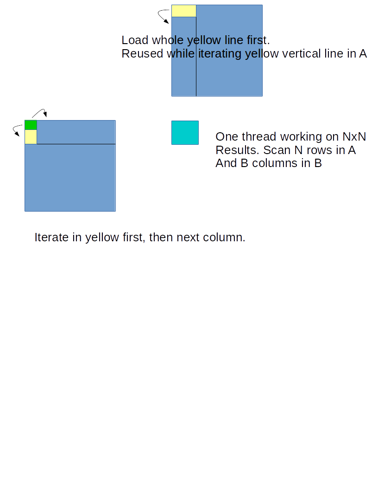

Assuming square matrix A, B

1. shared memory tiling. split A/B into tiles. TileSize (TS)

2. one warp can cover the whole width (or height) of tile.

3. Matrix level: scan based on Tile, horizontal scan in A, vertical scan in B, (transpose?) , each step load a tile of A and B into shared memory, say As, Bs.

4. register blocking:

   1. for each thread, alloc Acc[N]\[N] for result. Ar[N]\[N], Br[N]\[N] for caching a sub tile of As and Bs into registers.
   2. each thread load Ar, Br. total NxN read, generate NxN results. 
   3. optimize: use Ar, Br[N]. load Br[0]\[0:3], load A[0]\[0], , calculate Cr[0]\[0:3], then load A[1]\[0], reuse Br, calculate Cr[1]\[0:3]. Next, load Br[1]\[0:3], load A[0]\[1], calculate new Cr[0]\[0:3] and accumulate Cr[0]\[0:3]. 

   